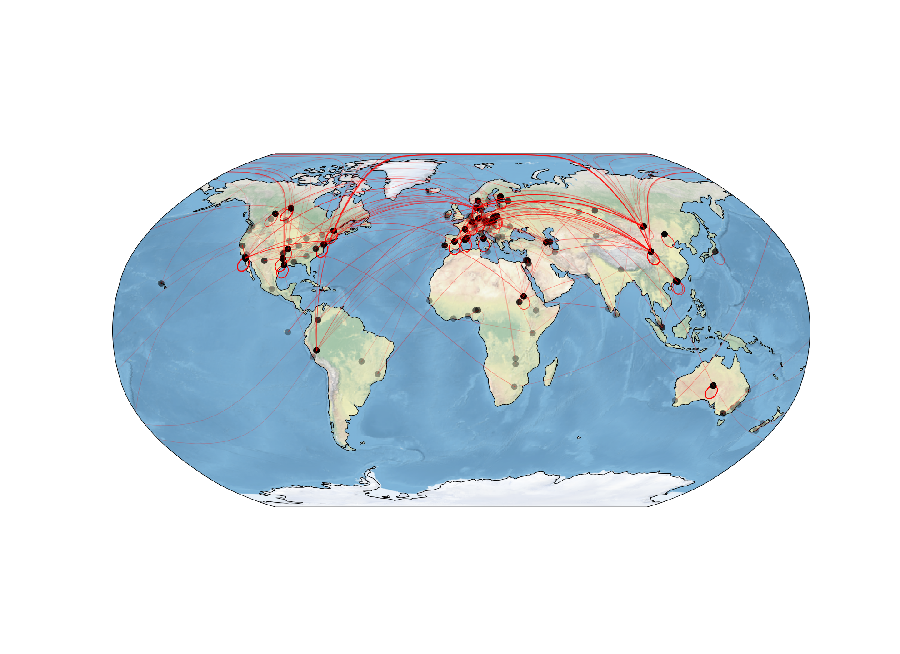
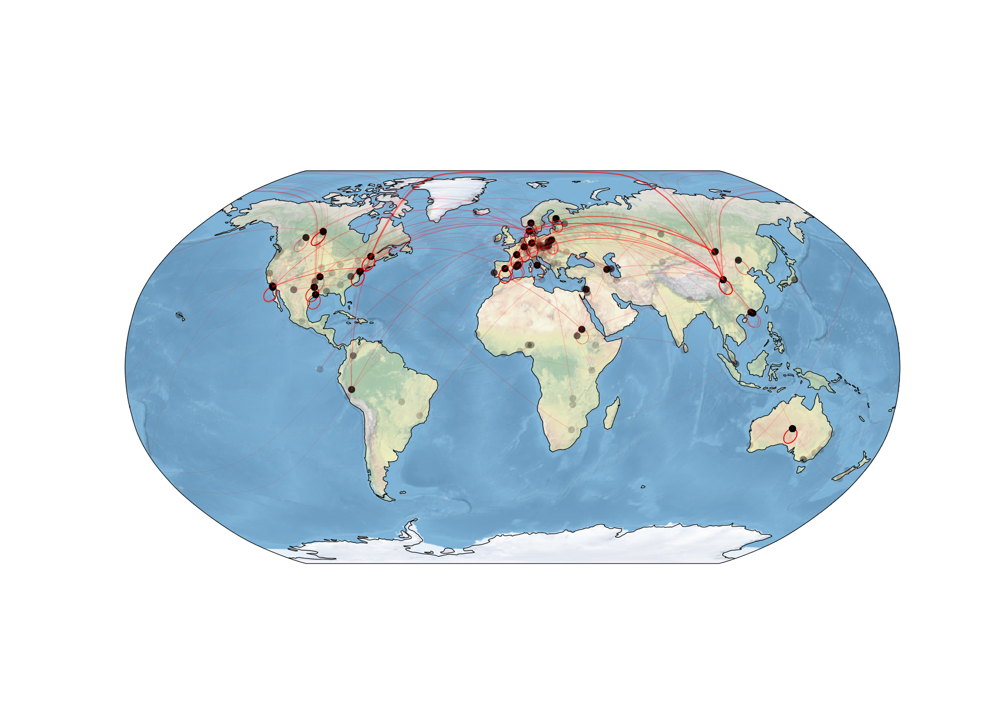
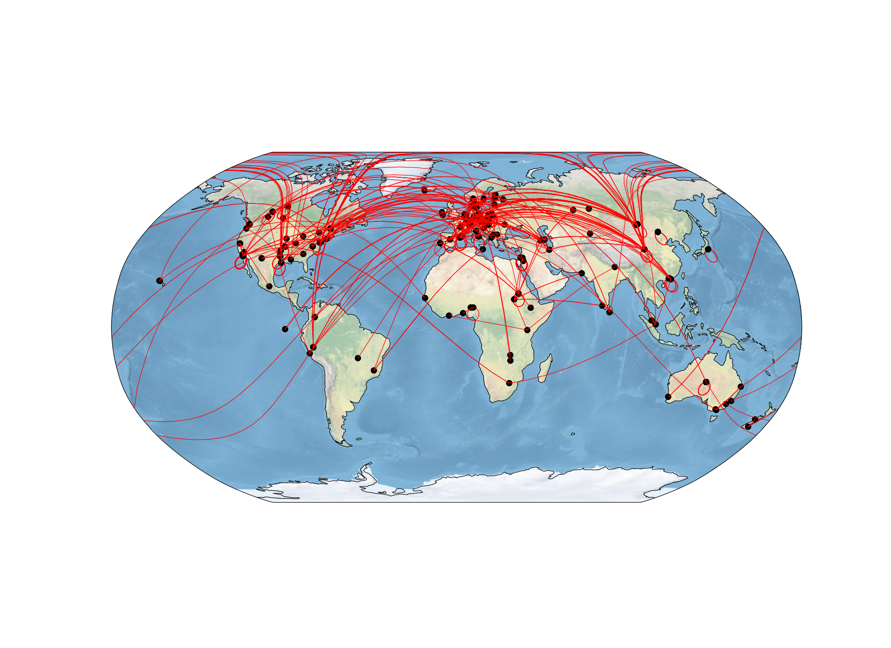

# The effect of different levels of alpha

We use the alpha channel (essentially the transparency) to show the number of times a line is drawn. For example, for the red lines, the alpha represents the number of times there are two sequences between two sites that are most similar to each other.

In the original version, we used an alpha of 0.2 that gives us this figure:

In response to a reviewer's question about why some sites didn't appear to have lines, we experimented with different levels of alpha. Here we provide the same image but with the alpha channel varying from 0.1 to 1.

Here is the image with alpha = 0.1

Here is the image with alpha = 1.0

We ended up using alpha = 0.3:

