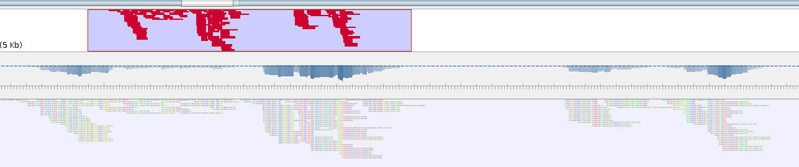
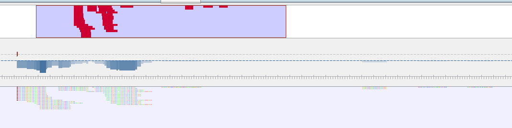
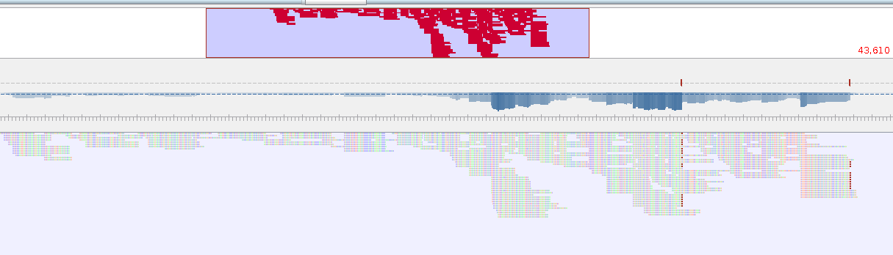

# Data from Sam Diaz Munoz and Collaborators

This data was provided by Sam Diaz Munoz, Kristen Gulino, Alan Twaddle, and Elodie Ghedin.

For detailed description of the samples, please take a look at [the PDF report](diazmunoz_etal_crAssphage_report.pdf) that Sam provided.

There are three primary sequences we have included in the analysis:

* NYC - these samples were collected from 14 locations around New York City and pooled. The details of the sampling are provided in [the PDF report](diazmunoz_etal_crAssphage_report.pdf). The location that is reported for these sequences is the geographic center of the samples.
* Davis 1 - A one liter sample was collected from the City of Davis WWTP on April 21, 2016 and two 5 ml aliquots were prepared. The two Davis samples are from these two aliquots.
* Davis 3

Note also that Sam Diaz Munoz attempted to collect samples from San Juan, Puerto Rico, but was unable to amplify any crAssphage from those samples.

## Metagenome sequences

To be able to compare the metagenome sequences with our other data collections, I reanalyzed Sam's metagenome sequences. First, I converted the SAM files to fastq files using samtools. (Note: I only show the commands for primerA, but the ones for B and C are the same).

```
samtools fastq nyc_a_very_sensitive.sam > nyc_a_very_sensitive.fastq
```

And then I remap them to crAssphage using bowtie2 and generate a bam file from those. This remapping allows our downstream analysis to continue as it has the correct reference ID in the bam file.

```
bowtie2 -p 8 -q --wrapper basic-0 --very-sensitive-local --no-unal --no-unal -x /home3/redwards/Phage/crAssphage/JQ995537 -U nyc_a_very_sensitive.fastq | samtools view -bS - | samtools sort -o bam/nyc_a_remapped.bam
```

For each of the three sequences here is the bowtie summary. A few reads no longer mapped, but the majority did:

### PrimerA

```
184 reads; of these:
  184 (100.00%) were unpaired; of these:
    16 (8.70%) aligned 0 times
    160 (86.96%) aligned exactly 1 time
    8 (4.35%) aligned >1 times
91.30% overall alignment rate
```

### PrimerB

```
52 reads; of these:
  52 (100.00%) were unpaired; of these:
    13 (25.00%) aligned 0 times
    38 (73.08%) aligned exactly 1 time
    1 (1.92%) aligned >1 times
75.00% overall alignment rate
```

### PrimerC

```
272 reads; of these:
  272 (100.00%) were unpaired; of these:
    38 (13.97%) aligned 0 times
    214 (78.68%) aligned exactly 1 time
    20 (7.35%) aligned >1 times
86.03% overall alignment rate
```


Index those bam files:

```
samtools index nyc_a_remapped.bam
```

Unfortunately, when we map these reads back, we don't have complete coverage of each of the PCR regions, as shown by the following coverage plots. These were created using [tablet](https://ics.hutton.ac.uk/tablet/), and you can view the [bam files here](nyc_snps/code_files/bam)

### PrimerA


### PrimerB


### PrimerC



### Gretel

Despite these gaps we tried to use [gretel to identify strains](../../../../Metagenomes/IdentifyingStrains/README.md) from the sequences, as we have done with other metagenomes, but unfortunately there is just not enough sequence coverage in these metagenomes to extract meaningful variants from the data.
