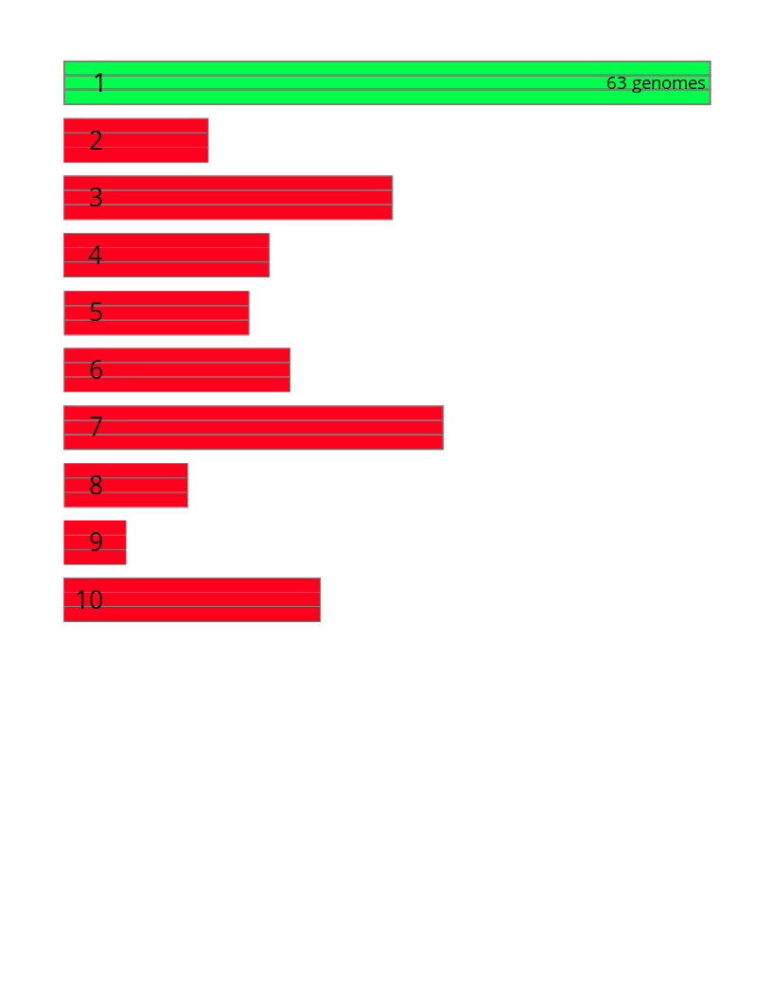

# crAss-like phages

These are the sequences of the crAss-like phages identified and described in Guerin E, Shkoporov A, Stockdale SR, Clooney AG, Ryan FJ, Sutton TDS, Draper LA, Gonzalez-Tortuero E, Ross RP, Hill C. 2018. Biology and Taxonomy of crAss-like Bacteriophages, the Most Abundant Virus in the Human Gut. [Cell Host Microbe 24:653–664.e6.](https://www.sciencedirect.com/science/article/pii/S1931312818305249?via%3Dihub) ([PubMed](https://www.ncbi.nlm.nih.gov/pubmed/30449316)). 

They identified 249 contigs that looked like crAssphage, and we have combined the fasta file provided in [their supplemental data](https://ars.els-cdn.com/content/image/1-s2.0-S1931312818305249-mmc6.zip) with the metadata provided in the same spot.

The sequences [crAssphage primer A](crAssphage_primerA.fasta), [crAssphage primer B](crAssphage_primerB.fasta), and [crAssphage primerC](crAssphage_primerC.fasta) contain the three primer regions extracted from the prototypical crAssphage sequence.

The files [Guerin primer A blastn](Guerin.primer_A.blastn), [Guerin primer B blastn](Guerin.primer_A.blastn), and [Guerin primer C blastn](Guerin.primer_A.blastn) contain the blastn results for each of the primer sequences against the [genomes](Guerin.fna)  identified by Guerin *et al.*.

Those blastn results are summarized in the `tsv` file [Guerin Primer Regions](GuerinPrimerRegions.tsv) with a `0` indicating that the primer region is not present and a `1` indicating that the primer region is present.

As shown in the figure below, all three amplicon regions are present in *all 63* of the *Candidate Genus 1* genomes, and none of the regions are  present in any of the other genomes.

