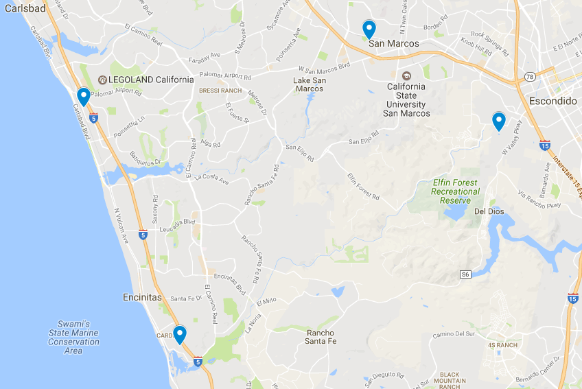

# Sequences from the USA

These sequences were all generated by the Edwards Lab from sewage sites around San Diego County. The waste water treatment plants are relatively close to each other.

City | Escondido | Cardiff by the Sea | Carlsbad | San Marcos
--- | --- | --- | --- | ---
**Escondido** | 0 | 18 | 19 | 7
**Cardiff by the Sea** | 18 | 0 | 12 | 17
**Carlsbad** | 19 | 12 | 0 | 14
**San Marcos** | 7 | 17 | 14 | 0

